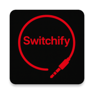

<p align="center">
  
</p>

# Switchify

An Android accessibility service that enables device control through adaptive switches, providing cursor-based and item scanning navigation for users with physical disabilities.

## Requirements

- Android 10 (API level 29) and above
- Android Studio (latest version recommended)

## Setup

### 1. Clone the repository
```bash
git clone https://github.com/switchifyapp/Switchify.git
cd Switchify
```

### 2. Configure local.properties
Create a `local.properties` file in the project root with the following:

```properties
# Path to your Android SDK
sdk.dir=/path/to/your/Android/Sdk

# RevenueCat public API key (obtain from project owner)
revenuecat.publicKey=<ask_for_key>

# Timberlogs API key (obtain from project owner)
timberlogs.apiKey=<ask_for_key>

# Supabase configuration (obtain from project owner)
supabase.projectUrl=<ask_for_url>
supabase.publishableKey=<ask_for_key>

# Google Sign-In web client ID (obtain from project owner)
google.webClientId=<ask_for_id>
```

All five keys are required — the build fails with a `Missing config` error if any are absent. CI builds read the same values from `REVENUECAT_PUBLIC_KEY`, `TIMBERLOGS_API_KEY`, `SUPABASE_URL`, `SUPABASE_ANON_KEY`, and `GOOGLE_WEB_CLIENT_ID` environment variables.

### 3. Build and run
```bash
./gradlew build
```

## Contributing

1. Fork this repository
2. Clone your forked repository
3. Create a new branch (`git checkout -b feature/your-feature`)
4. Make your changes
5. Commit and push your changes
6. Create a pull request

### Commit messages

Use Conventional Commits for concise messages:

- Format: `type: subject`
- Allowed `type`: feat, fix, docs, chore, refactor, perf, test, build, ci, style, revert

Enable repo-provided hook to enforce the format:

```bash
git config core.hooksPath .githooks
chmod +x .githooks/commit-msg
```

## License

Switchify is licensed under the [GNU Affero General Public License v3.0](LICENSE) (AGPL-3.0).

In short: you are free to use, modify, and distribute Switchify, but any modifications or derivative works (including those made available over a network) must also be released under the AGPL-3.0 and include their full source code.

Commercial licenses that exempt licensees from the AGPL copyleft obligations are available on request — contact <owen@switchifyapp.com> for details.

Copyright (C) 2024-2026 Owen McGirr. Released under the AGPL-3.0.

## Links

- [Google Play Store](https://play.google.com/store/apps/details?id=com.enaboapps.switchify)
- [switchifyapp.com](https://switchifyapp.com)
